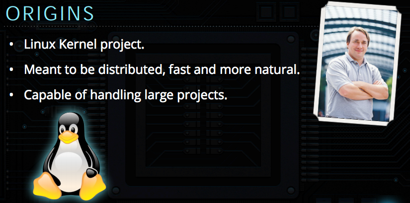
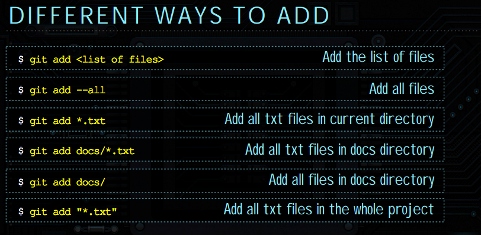

<section>
  <h1>Week 2</h1>
  <h3>Intermediate Ruby, Unix and Git</h3>
</section>

<section>
  <h2>Homework Questions?</h2>
</section>

<section>
  <h2>Diving Right In</h2>
</section>

<section>
  <h1>Break</h1>
</section>

<section>
  <section>
    <h2>Unix Commands</h2>
  </section>

  <section>
    <h3>Common Unix Commands</h3>
    <ul>
      <li>cd - Change directory</li>
      <li>mkdir - Make directory</li>
      <li>rm - Remove file or directory</li>
      <li>mv - Move (or rename) a file or directory</li>
      <li>touch - Create an empty file</li>
      <li>cat - Concatinate and print out files</li>
    </ul>
  </section>

  <section>
    <h2>General Command Syntax</h2>

```
command_name [sub_command] [options] [files ...]

rm -r folder_1 folder_2
```
  </section>

  <section>
    <h2>Changing directories</h2>

```
cd workspace
```
  </section>

  <section>
    <h2>Making directories</h2>

```
mkdir test-dir
```
  </section>

  <section>
    <h2>Creating a file</h2>

```
cd test-dir
touch hello.txt
```
  </section>

  <section>
    <h2>Removing a file</h2>

```
rm hello.txt
```
  </section>

  <section>
    <h2>Going up a directory</h2>

```
cd ..
```
  </section>

  <section>
    <h2>Removing up a directory</h2>

```
rm -r test-dir
```
  </section>

  <section>
    <h2>Back home</h2>

```
cd ~
```
  </section>

  <section>
    <h2>Printing out a file</h2>

```
cat hello.rb
```
  </section>

  <section>
    <h2>Getting Help</h2>

```
rails --help

man cat
```
  </section>
</section>

<section>
  <section>
    <h2>Git</h2>
  </section>

  <section>
    <ul>
      <li>Distributed Version Control System (DVCS)</li>
      <li>Created by Linus Torvalds on Linux Kernel Project</li>
      <li>Allows developers to collaborate easily</li>
      <li>You can commit changes very quickly.</li>
      <li> Work offline</li>
      <li>Everyone has a complete copy</li>
      <li>Used by Github, Heroku</li>
    </ul>
  </section>

  <section>
  	<p></p>
  </section>
  
  <section>
    <h3>Cloning a git project</h3>
    <p>git clone https://github.com/durango-ruby-school/Instructor-Notes.git</p>
  </section>
  
  <section> 
  	<h3>Gitting help</h3>
  	<p>git help COMMAND</p>
  	<p>git help config</p>
  	<p>git help add</p>
  </section>
  
  <section> 
  	<h3>Configure your machine</h3>
  	<p>git config --global user.name "Your Name"</p>
  	<p>git config --global user.email myemail@example.com</p>
  	<p>git config --global color.ui true</p>
  </section>
  
  <section>
  	<h3>Branch</h3>
  	<p>git branch <BRANCH_NAME></p>
  	<p>git checkout <BRANCH_NAME></p>
  	<h5>OR</h5>
  	<p>git checkout -b <BRANCH_NAME></p>  	
  </section>
  
  <section>
  	<h3>Check repo status</h3>
  	<p>git status .</p>  
  </section>

  <section>
  	<h3>Add file to staging area</h3>
  	<p>git add .</p>
  	<p>git add path/to/file</p> 
 </section>
 <section> 	
  	<p></p> 
  </section>  	
  
  <section>
  	<h3>Commit change to repo.</h3>
  	<p>git commit -m "Commit message"</p>
  	<p>Keep commit messages clear and in present tense.</p>  
  </section>  	
  
  <section>
  	<h3>Git Timeline History</h3>
  	<p>git log</p>
  	<p>Keep commit messages clear and in present tense.</p>  
  </section>  	

  <section>
  	<h3>Commit Branch and make pull request</h3>
  	<p>git push origin <BRANCH_NAME></p>
  	<p>Go to Github and use pull request with comments.</p>  
  </section> 
  
  <section>
  	<h3>More Git</h3>
  	<p>
  	<b>Starting Fresh</b> 
  		<ul>
  			<li>git init</li>
  			<li>git add .</li>
  			<li>git commit -m "Initial commit"</li>
  		</ul>		
  	</p>
  	<p><b>Ignoring files with .gitignore</b>
  		<ul>
  			<li>/.file-to-ignore</li>
  			<li>/dir/*.txt</li>
  		</ul>	
  	</p>
  	<p><b>Remotes Branches, HEAD, tags and resets</b></p>
  	
  </section> 
  
  <section>
  	<h3>Git Questions?</h3>
  </section>  

</section>

<section>
  <h2>Homework</h2>
  <ul>
    <li class="fragment">Thoughtbot Advanced Ruby Video
      <ul>
        <li>Follow along and build the examples</li>
      </ul>
    </li>
    <li class="fragment">try.github.io</li>
  </ul>
</section>

<section>
  <h2>See you next week!</h2>
</section>
